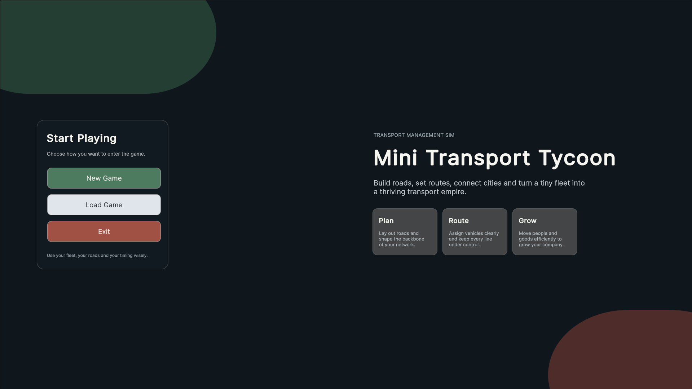
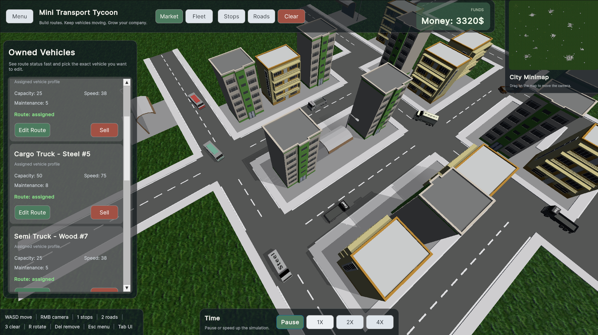
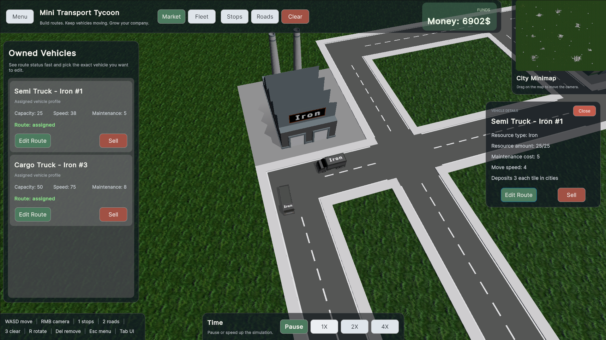
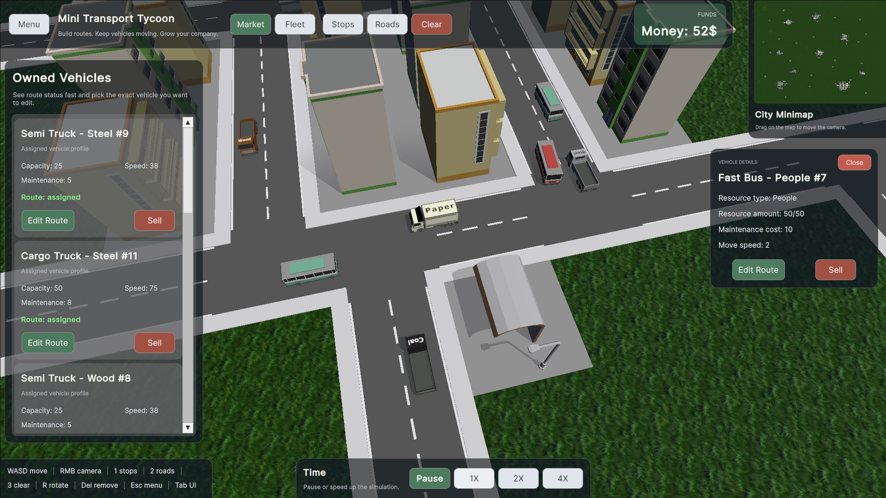
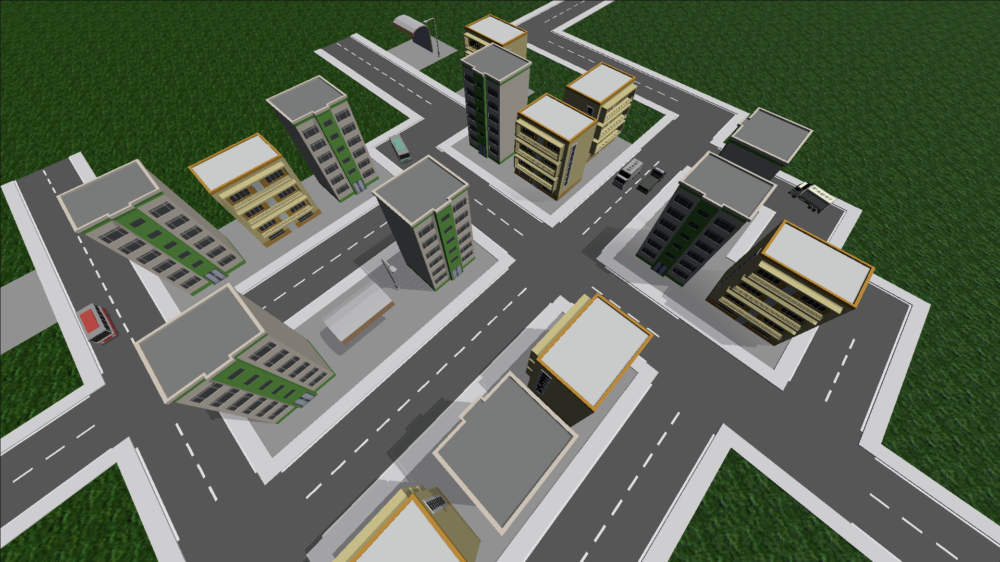
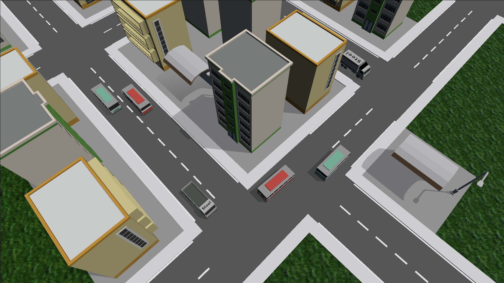
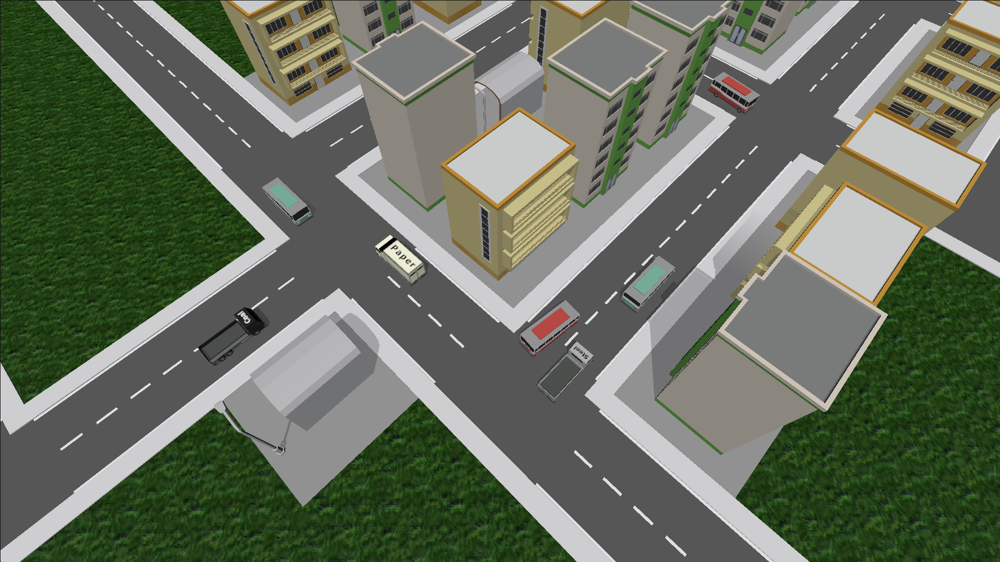

# Mini Transport Tycoon

Mini Transport Tycoon egy Unityben készült közlekedési és logisztikai játék. A játék lényege, hogy a pályán lévő városok és ipari épületek között működő úthálózatot és járműforgalmat kell kialakítani. A játékos utakat épít, megállókat helyez le, járműveket vásárol, majd útvonalat ad nekik, hogy a rendszer hosszú távon is működjön.

## Rövid ismertető

A játék elején egy előre elkészített pálya töltődik be, amelyen már megtalálhatók a városok és néhány termelőhely. Erre lehet ráépíteni az úthálózatot, elhelyezni a buszmegállókat, megvenni a járműveket, majd útvonalat adni nekik. A cél az, hogy a járművek ne csak elinduljanak, hanem ténylegesen használható körforgásban közlekedjenek, és pénzt termeljenek.

Az utasszállítás és az áruszállítás is része a játéknak. A buszok a városok és buszmegállók között mozognak, a teherjárművek pedig nyersanyagokat és feldolgozott anyagokat visznek a megfelelő helyekre.

## Főbb funkciók

- Úthálózat építése dinamikusan kapcsolódó útelemekkel.
- Buszmegállók elhelyezése a városi közlekedés kiszolgálására.
- Járművásárlás külön járműlistából.
- Saját járművek listázása, kezelése és eladása.
- Útvonal szerkesztése a járművekhez.
- Utasszállítás buszokkal.
- Áruszállítás többféle nyersanyaggal és feldolgozott erőforrással.
- Nyersanyagtermelő és feldolgozó épületek kezelése.
- Minimap alapú navigáció.
- Játéksebesség állítása `Pause`, `1x`, `2x` és `4x` módok között.
- Mentés és betöltés JSON alapú állapotkezeléssel.
- Pénzrendszer és fenntartási költségek.
- Game over állapot, ha a játékos pénze elfogy.

## A játék rendszerei

### Közlekedés

A járművek nem csak két pont között mennek oda-vissza, hanem az úthálózatra illesztett útvonal alapján közlekednek. Az útvonal megadásához a játékos kijelöli azokat a csomópontokat, amelyeken a járműnek végig kell mennie, a rendszer pedig ezekből állít elő egy bejárható útvonalat.

### Logisztika

A játékban többféle erőforrás is megjelenik. A nyersanyagok közé tartozik a fa, a szén és a vas, ezekből pedig feldolgozott anyagok, például papír és acél készülhetnek. Emiatt a pályán nem csak egyszerű szállítás történik, hanem egy kisebb logisztikai lánc is felépíthető.

### Gazdaság

Minden megvásárolt jármű pénzbe kerül, és működés közben fenntartási költséget is levon. A bevétel a sikeres szállításokból jön, ezért nem elég csak felépíteni a hálózatot, azt működtetni is kell úgy, hogy ne fusson mínuszba.

## Irányítás

Az alábbi vezérlés a játékban megjelenő help overlay alapján:

- `W`, `A`, `S`, `D` - kamera mozgatása
- `Jobb egérgomb + húzás` - kamera forgatása
- `1` - buszmegálló kiválasztása
- `2` - út kiválasztása
- `3` - kijelölés törlése
- `R` - az aktuális elem elforgatása
- `Delete` - bontás / törlés
- `Esc` - menü megnyitása
- `Tab` - UI elrejtése / visszahozása

## Járművek

A játékban több járműtípus is elérhető:

- buszok utasszállításhoz
- semi truckok kisebb kapacitású áruszállításhoz
- cargo truckok nagyobb kapacitású áruszállításhoz

Az egyes járművek sebességben, kapacitásban és fenntartási költségben is eltérnek egymástól.

## Mentés és betöltés

A játék támogatja a mentést és a korábbi állapot visszatöltését. Új játék indításakor egy alap pálya töltődik be, de a játék közben kialakított állapot külön is elmenthető, majd később vissza is tölthető.

## Technikai háttér

- Játékmotor: Unity 6
- Verzió: `6000.3.7f1`
- Nyelv: C#
- UI: UI Toolkit

## Online elérés / Játék indítása

A játék böngészőből is kipróbálható az alábbi linken:

[Mini Transport Tycoon Web Demo](https://bl-studio-c61c9a.szofttech.gitlab-pages.hu/demo/)

## Képek

### Főmenü

### Játékbeli képek UI-al

### Játékbeli képek UI nélkül

## Videó

Gameplay videó a játékról (UI rework előtt):

[Mini Transport Tycoon Gameplay Video](https://www.youtube.com/watch?v=x5_ILxdACd8)

## Felhasznált assetek

A projektben az alábbi assetek lettek felhasználva:

- [Stylized Grass Texture](https://assetstore.unity.com/packages/2d/textures-materials/glass/stylized-grass-texture-153153)
- [SimplePoly City - Low Poly Assets](https://assetstore.unity.com/packages/3d/environments/simplepoly-city-low-poly-assets-58899)